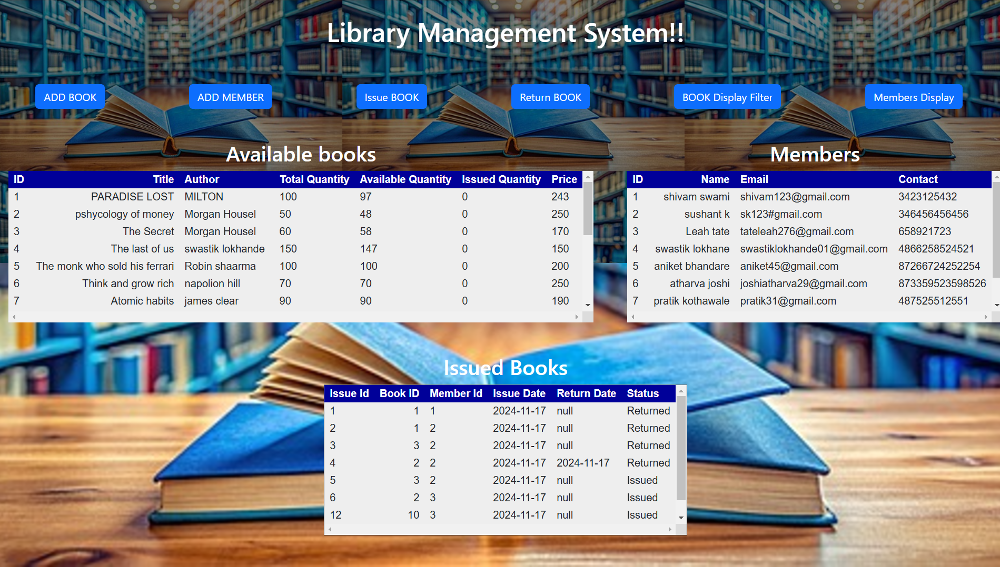
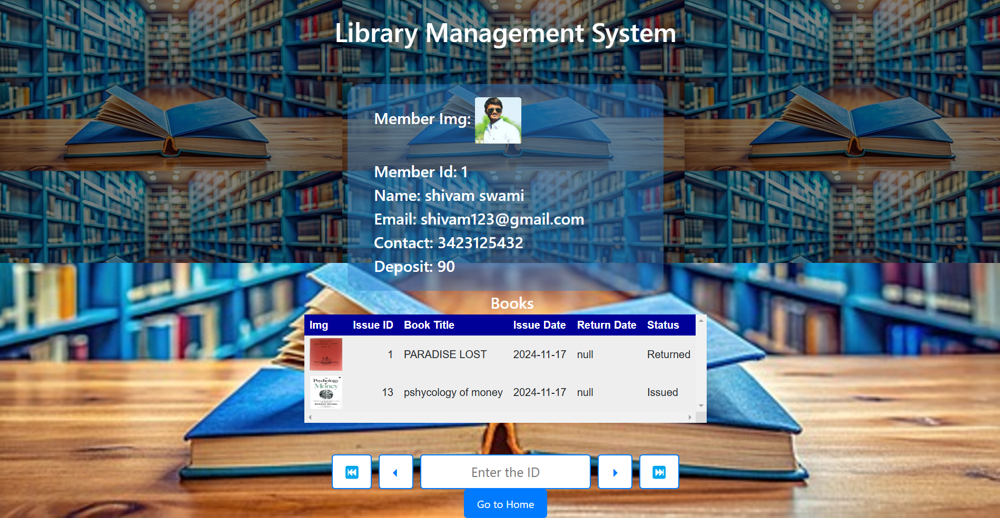

# Digital Library Manager (Java-based Web Application)

## Overview
This project is a **Digital Library Manager (Java-based Web Application)
** built using Java Servlets. It allows managing books, members, and book issuance in a library. The system features login and registration for users, along with the ability to add, issue, and return books. It also includes image upload functionality for books and members.

---

## Features
### 1. **Login Servlet**
- Handles user login functionality.
- Allows authorized users to access the system.

### 2. **Register Servlet**
- Allows new users to register themselves in the system.
- Collects user details for registration.

### 3. **BookServlet**
- Serves as the main page of the project.
- Displays three tables:
  - **Books**: List of all books in the library.
  - **Members**: List of all registered members.
  - **Issued Books**: Details of issued books.
- Provides six buttons for different functionalities:
  1. **Add Book**: Redirects to the `AddBookServlet` for adding books.
  2. **Add Member**: Redirects to the `AddMemberServlet` for adding members.
  3. **Issue Book**: Redirects to the `IssueServlet` for issuing books.
  4. **Return Book**: Redirects to the `ReturnBookServlet` for returning books.
  5. **Book Display Filter**: Displays books based on various filters.
  6. **Member Display**: Displays member details along with borrowed/returned book information.

### 4. **AddBookServlet**
- Contains a form to add a new book.
- Captures book details such as title, author, publisher, year, quantity, and price.
- Allows uploading an image for the book.
- Saves book details and image path to the database.

### 5. **AddMemberServlet**
- Contains a form to add a new library member.
- Captures member details such as name, email, phone number, and deposit.
- Allows uploading an image for the member.
- Saves member details and image path to the database.

### 6. **IssueServlet**
- Displays two tables:
  - **Books Table**: Shows available books.
  - **Members Table**: Shows registered members.
- Allows selecting a book and a member by clicking their respective IDs.
- Issues a book to a member if:
  - The book is available.
  - The member has sufficient deposit.
- Displays appropriate messages for unavailability or low deposit.

### 7. **ReturnBookServlet**
- Handles book return functionality.
- Updates the database to mark the book as returned.
- Increments the available quantity of the returned book.

### 8. **MemberDisplayServlet**
- Displays detailed information about members, including:
  - Member image.
  - Member details (name, email, phone number, etc.).
  - List of borrowed or returned books.

### 9. **RequiredBookDataServlet**
- Allows filtering books based on specific criteria.
- Includes multiple checkboxes for selecting filters.
- Displays the filtered book data upon submission.

### 9. **Screenshots**







---

## Technologies Used
- **Backend**: Java Servlets
- **Frontend**: HTML, CSS, Bootstrap
- **Database**: MySQL
- **Server**: Apache Tomcat
- **File Uploads**: Handled using `javax.servlet.http.Part`

---

## Setup Instructions
1. Clone the repository:
   ```bash
   git clone <repository-url>
